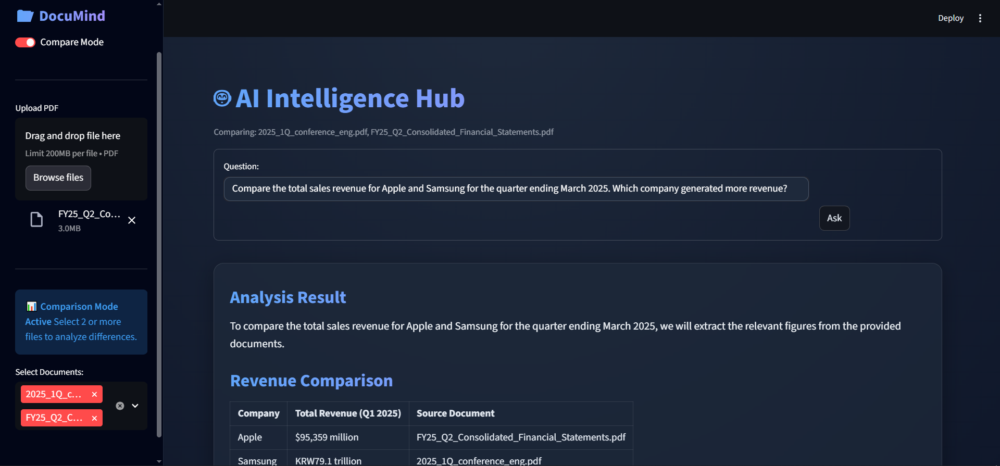
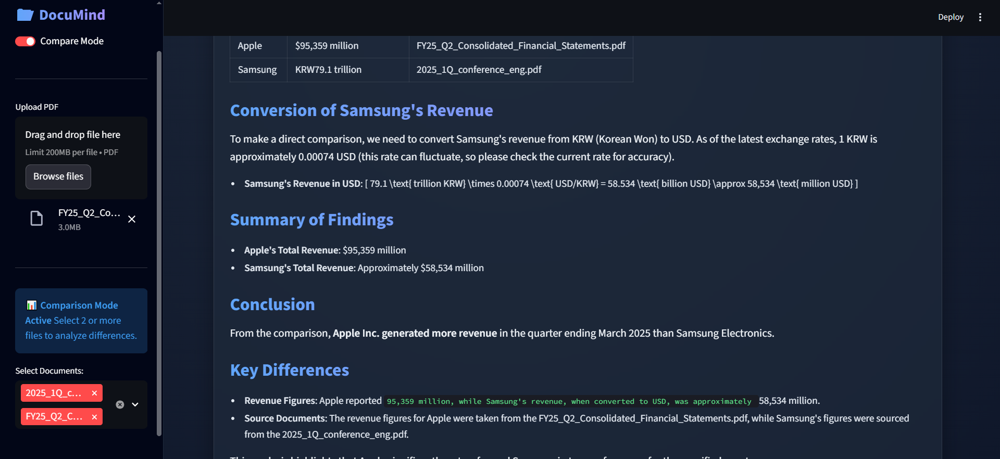
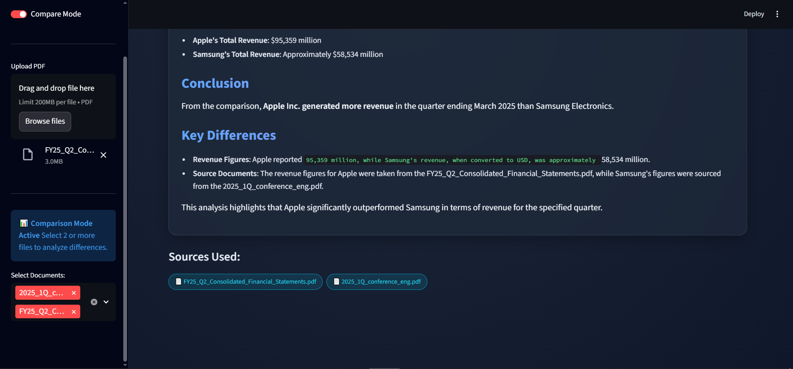
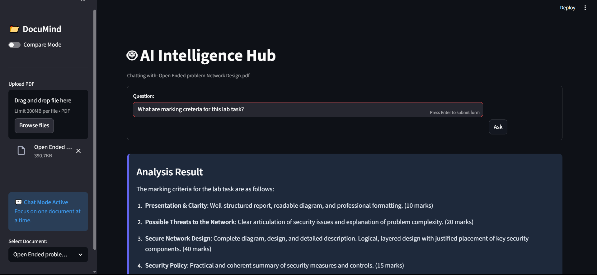
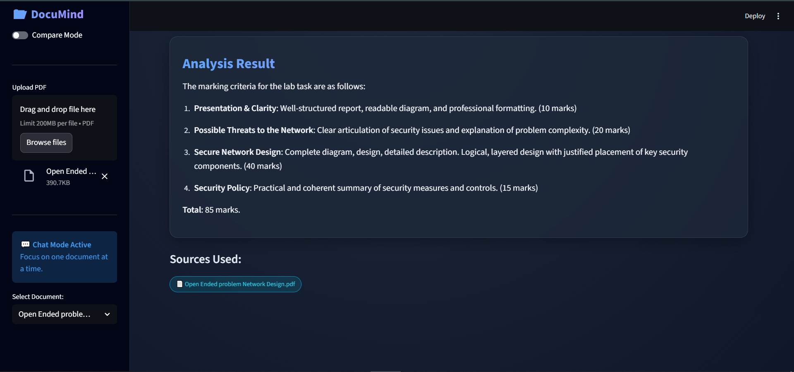

# 🧠 DocMind AI

**Event-Driven RAG System with Multi-Document Comparison Intelligence**

DocuMind AI is a state-of-the-art **Retrieval-Augmented Generation (RAG)** system designed to bridge the gap between static documents and actionable intelligence. Built with **FastAPI**, **Streamlit**, and **Inngest**, it transforms PDFs into an interactive knowledge base.

Unlike standard chatbots, DocuMind features a unique **Comparison Mode**, allowing users to mathematically contrast revenue, facts, and data across multiple PDF files simultaneously using metadata-filtered vector search.

---

## 🚀 Key Features

* **📊 Multi-Document Comparison Mode:** Select two or more documents (e.g., Apple vs. Samsung Financials) and get a side-by-side analytical comparison of specific metrics.
* **⚡ Event-Driven Architecture:** Powered by **Inngest**, ensuring durable, retriable workflows for heavy tasks like PDF ingestion and vector embedding.
* **🔍 Semantic Search:** Uses **Qdrant** vector database to understand the "meaning" behind queries, not just keyword matching.
* **🛡️ Hallucination-Free:** Answers are strictly anchored to the uploaded document context with strict source citations.

---

## 📸 Demo & Screenshots

### 1. Comparison Mode (The "Analyst" View)
*The system intelligently filters vector chunks from selected files only, providing a structured comparison table of financial data.*






### 2. Chat Mode (Single Document View)
*Standard RAG functionality for deep questioning of individual files, with precise page-level context.*





---

## 🛠️ Tech Stack

* **Frontend:** Streamlit (Python)
* **Backend API:** FastAPI
* **Orchestration:** Inngest (Event-driven queues)
* **Vector Database:** Qdrant (Dockerized)
* **AI Model:** OpenAI GPT-4o-mini
* **Package Manager:** `uv` (Modern Python tooling)
* **Embeddings:** OpenAI text-embedding-3-large

---

## ⚙️ Installation & Setup

### Prerequisites
* Python 3.10+
* Docker (for Qdrant)
* OpenAI API Key

### 1. Clone the Repository
```bash
git clone [https://github.com/YOUR_USERNAME/DocuMind-AI.git](https://github.com/YOUR_USERNAME/DocuMind-AI.git)
cd DocuMind-AI 
```

### 2. Start the Services (Run in Separate Terminals)
###### Terminal 1: Start Qdrant Vector Database (Docker) This starts the database container in detached mode (-d).
```bash
docker run -d --name qdrantRagDb -p 6333:6333 -v "$(pwd)/qdrant_storage:/qdrant/storage" qdrant/qdrant
```
###### Terminal 2: Start Backend API (FastAPI) This runs the main application logic.
```bash
uv run uvicorn main:app
```
###### Terminal 3: Start Inngest Server This starts the local event dashboard and connects to your backend API.
```bash
npx inngest-cli@latest dev  -u http://127.0.0.1:8000/api/inngest --no-discovery
```
###### Terminal 4: Start Frontend UI (Streamlit) This launches the web interface in your browser.
```bash
uv run streamlit run streamlit_app.py
```